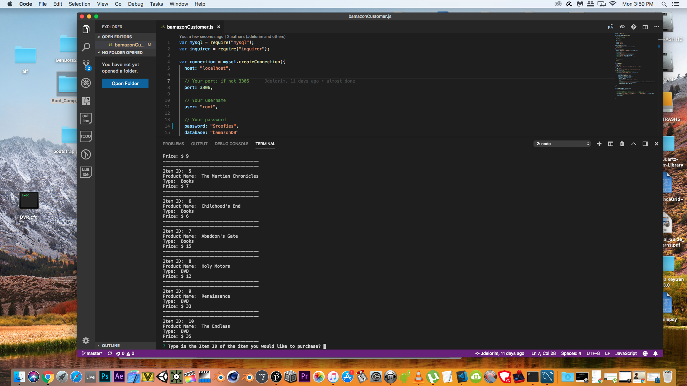
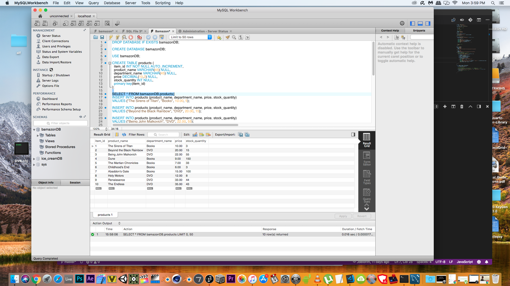
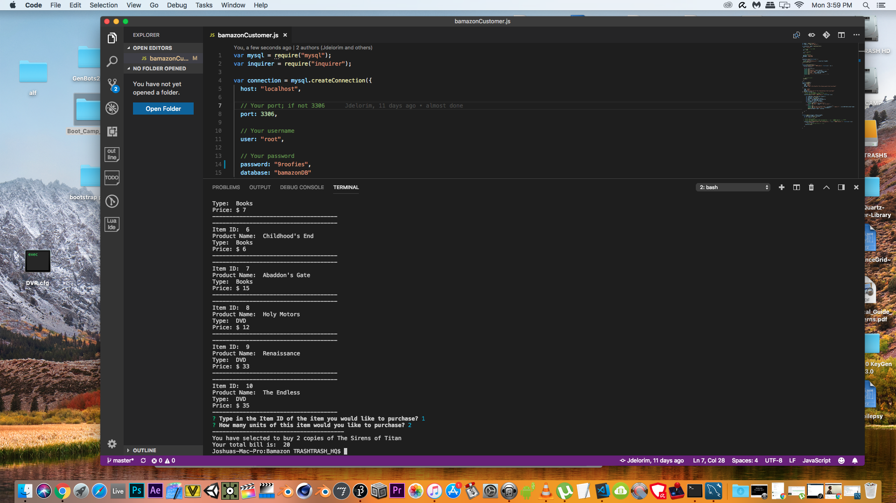

# Bamazon OVERVIEW
-This project takes a store database using mySQL and process and customers order.
-It was created using mySQL,node.js.

Here are Iamges to show it was working.
1. 
    Format: 
2. 
   Format: 
3. 
   Format: 
4. 
   Format: 
5. 
   Format: 